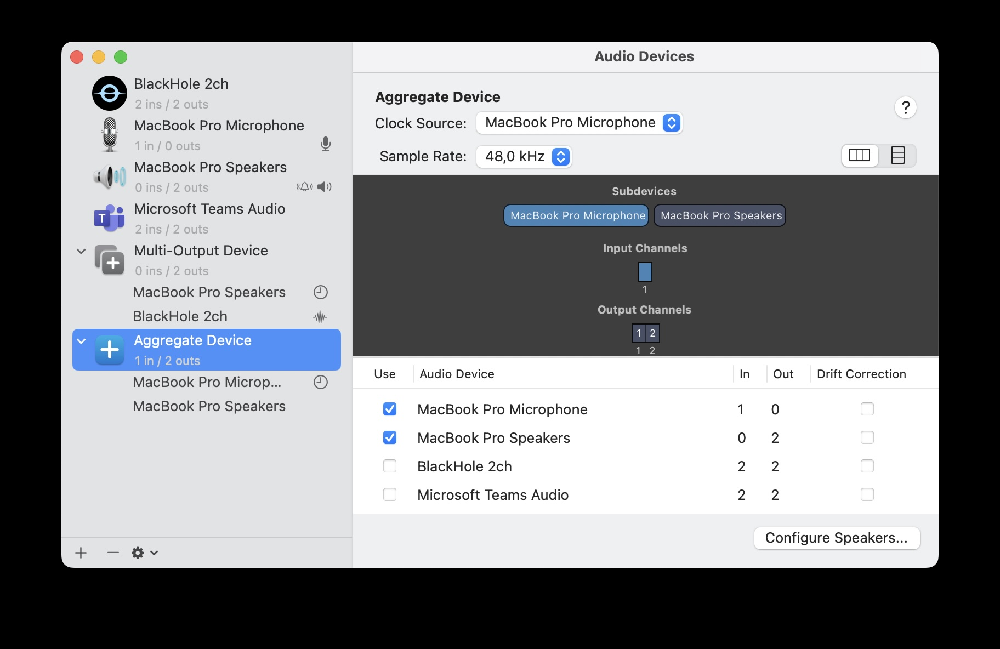

# Automated Meeting Note Creation

This project automates the process of creating meeting notes on Apple M processor machines. The workflow is based on several tools and technologies, including FFmpeg, Whisper, Ollama, jq, and shell scripting binding everything together.
It is not as powerful as cloud based tools like for example [Fireflies](https://fireflies.ai), but it runs completely local. No sharing of confidential data with 3rd party cloud providers, no subscription.

## System requirements

The described setup needs a Mac with Apple Silicon with at least 16G ram. It might run with less, if you reduce LLM model sizes and/or context window at reduced quality or with the risk of loosing information. 
The current settup is using llama3_gradient with a flexible context window - memory usage will increase with meeting length. 
On an M3 MacBook Pro with 18G it takes about 60 to 90 seconds to run this for a 60 min meeting, which is also about the max for memory usage on that machine.

If you want to change the model, be aware that the context length of most local LLMs is limited. Some might not be able to process 30 min.

## Behind the scenes Workflow

1. **FFmpeg**: Captures audio during meetings in a whisper.cpp accepted format. A special audio setup is required to capture both, microphone and incoming audio.
3. **Whisper.cpp**: A C++ command-line implementation of OpenAI Whisper used for audio transcription.
4. **Ollama (llama3.1)**: Summarizes the transcribed text to create meeting notes.
5. **jq**: Processes JSON data.
6. **Shell Script**: Automates the entire flow.

## Setup
To set up your machine, you need to do some configuration and install the necessary software.
### Audio
First configure your local sound setup, to allow simultanious capturing of microphone and incoming audio. 
Open **Audio MIDI Setup** application, either from your **Applications > Utility folder** or via Spotlight search.
Create a new aggregate device using the + button bottom left.


> ***Note:*** If you are using this with MS Teams, you need to select Teams as Audio Device. De-select the speakers to avoid echo. If you're using headphones, you might want to add headphone micro. Test your setups before using in anger!

### Tools
Install homebrew if you haven't done that already:
```bash
# Install Homebrew
/bin/bash -c "$(curl -fsSL https://raw.githubusercontent.com/Homebrew/install/HEAD/install.sh)"
```
Now install ***FFmpeg*** for audio processing and ***jq*** for JSON processing:
```bash

# Install FFmpeg
brew install ffmpeg

# Install jq
brew install jq
```

### Audio transcription: whisper
[Whisper.cpp](https://github.com/ggerganov/whisper.cpp/tree/master) is a lightweight implementation of the openAI whisper model heavily optimized for Apple silicon CPUs.
```bash
# Switch to home directory, or choose another preferred directory
cd ~
# Get the package
git clone https://github.com/ggerganov/whisper.cpp.git

# Download the model. Large-v2 is preferred, it provides more consistent results at a slightly lower accurracy as v3.
cd whisper.cpp
bash ./models/download-ggml-model.sh ggml-large-v2-q5_0

# now build the software
make
```

### Optional speed up
To leverage the Apple Neural Engine (ANE) via Core ML and speed up transcription, some more installs are required. 
This is a bit fragile for dependencies and python versions. It is [reported to run on M1 and M2](https://github.com/ggerganov/whisper.cpp/pull/566), haven't been able to get it to run on M3.
First check your Python version
```bash
python3 --version
```
It should be at least 3.10, 3.12 preferred. To get a recent version you can use homebrew - if you need to maintain different versions on your machine, other options are preferred.
```bash
brew install python3
```
You need a recent pip, so
```bash
python3 -m pip install --upgrade pip
```
Homebrew should have command line tools already installed, otherwise
```bash
xcode-select --install
```
Now we get everything together to build for Core ML
```bash
pip install ane_transformers
pip install openai-whisper
pip install coremltools
```
Now build your model and whisper with Core ML support:
```bash
# In case you did download another model earlier, adjust accordingly
# the resulting model will be named ggml-<NAME>-encoder.mlmodelc
./models/generate-coreml-model.sh ggml-large-v2-q5_0
make clean
WHISPER_COREML=1 make -j
cmake -B build -DWHISPER_COREML=1
cmake --build build -j --config Release
```
First run will be slow, because the Core ML model gets compiled. Consecutive runs are fast.

> **NOTE:** You will need to edit the file capture.sh and update the model name

### Get Ollama to loacally run LLMs
Ollama is a runtime environment for Large Language Models. Get the installer:
https://ollama.com/download/Ollama-darwin.zip

Once completed, you can download a model with:
```bash
ollama pull llama3.1:8b
```
This will download ***llama3.1:8b***. The model is a general purpose model with a context length of up to 128k (if you happen to have the required memory). It is providing a fair summary and able to output HTML.
[Try what works best for you](https://github.com/ollama/ollama). To change the model, you will as well need to adjust the shell script ***capture.sh***. And don't forget to limit the context window or set it to 8k fixed.

### Get the shell script 
The shell script ***capture.sh*** from this repository provides a very basic way to connect all the tools and channel the date from ***FFmpeg*** audio recording through ***whisper*** for audio to text transcription and finally the llm model running in ***Ollama*** to summarize the meeting notes that will be pasted into an ***Outlook*** mail. On the way the json will be processed with ***jq***

Download the file to your user directory or any other prefered custom directory. Then make it executable
```bash
cd ~
chmod +x ./capture.sh
```

Ready to go!

## Running
Before you start, don't forget to tell everyone in your call or meeting that you will capture audio and get consent. Share that this is all local.
Now start the script:
```bash
./capture.sh
```
It will ask you to provide the ID of your device:
```bash
[0] Aggregate Device
[1] MacBook Pro Microphone
[2] Microsoft Teams Audio
```
Press the number key to select and continue. Be aware there is no error check.
Look for the Aggregate Device we configured earlier. The DEVICE ID is just the number.
The ID might be changing when you plugin a monitor or camera that is expected by the system to have a microphone (even if they don't).

> **NOTE:** You can also provide the device ID as paramter to the script

Keep the shell open while you record, then press any key in the shell to finish recording.
Based on the length of your meeting and the model you use the processing will take from a few seconds to a few minutes. 
A new Outlook mail window will open prepopulated with the draft meeting notes.


